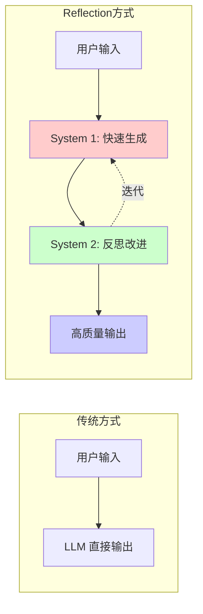
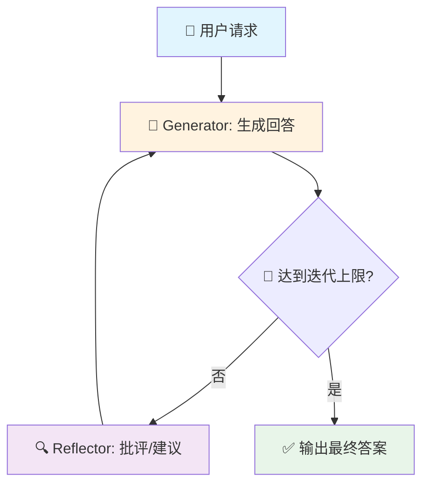
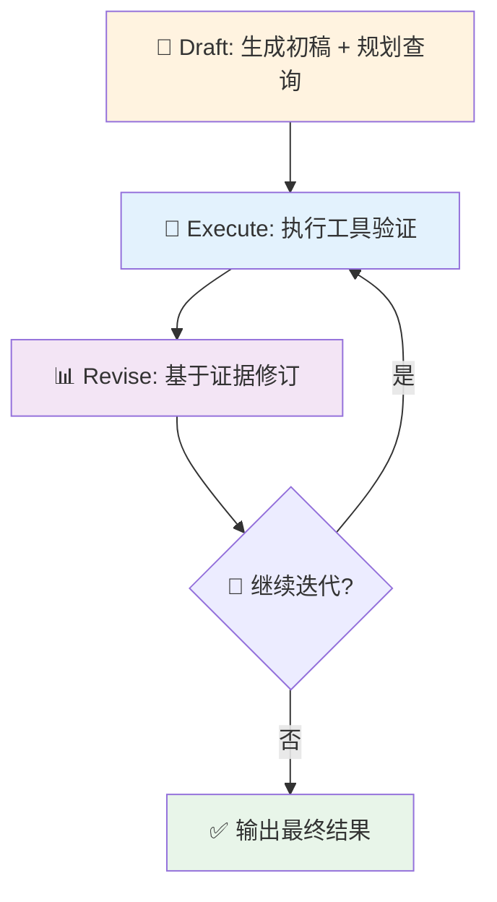
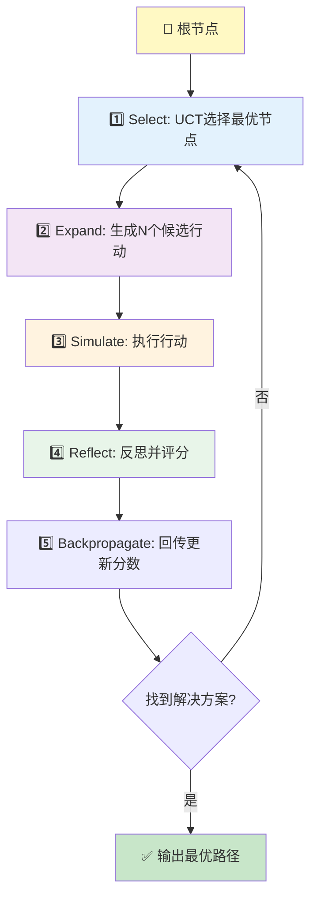
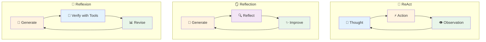
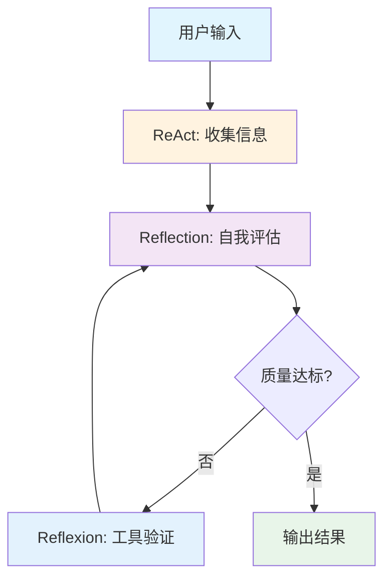
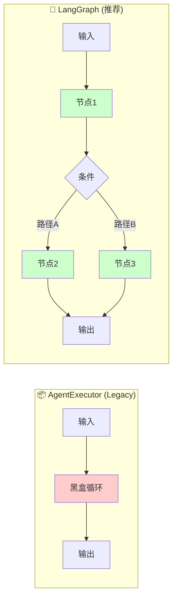
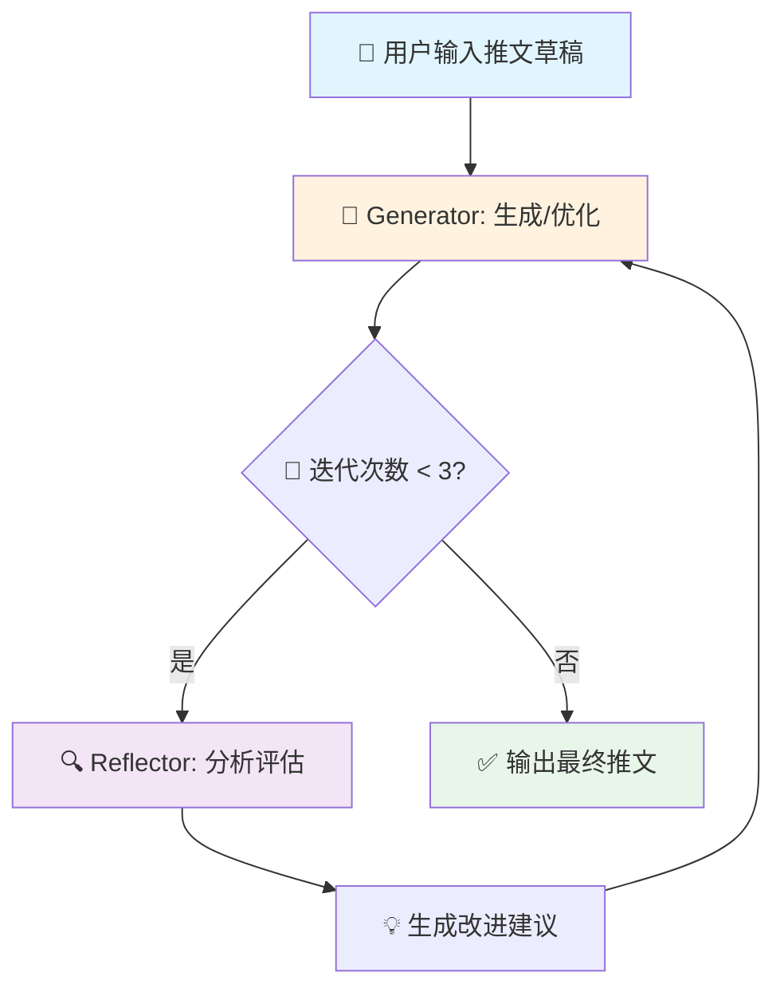
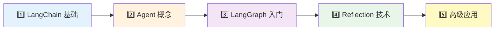

## 🚀 Reflection 是什么？为什么值得用？

Reflection Agents 的核心思想是让模型在“生成之后再自我批评和改写”，通过多轮迭代把答案从“能用”提升到“更好”。

<IframeEmbed
  src="/visualizations/langgraph-reflection-loop.html"
  minHeight={760}
  title="LangGraph Reflection Loop Visualizer"
/>

你可以先看下面的可视化：每一轮都会增加 Token 消耗和延迟，但通常能换来更高的质量与更稳的推理链路。

# LangGraph Reflection Agents 完全指南

> **让 AI 学会"三思而后行"** —— 通过自我反思机制，显著提升 LLM 输出质量

## 📚 前言

在使用 LLM 时，你是否遇到过这些问题？

- 生成的内容质量参差不齐
- 复杂任务容易出错且无法自我纠正
- 缺乏对输出结果的验证机制

**Reflection Agents（反思代理）** 正是解决这些问题的关键技术。它让 LLM 具备"自我审视"的能力，通过迭代改进输出质量。

本文基于 LangGraph 官方文档 [<sup>1</sup>](https://langchain-ai.github.io/langgraph/) 和 LangChain 博客 [<sup>2</sup>](https://blog.langchain.com/reflection-agents/)，系统梳理 Reflection Agents 的核心概念与实现方法。

---

## 🎯 什么是 Reflection Agents？

### 核心思想

Reflection Agents 的灵感来源于认知心理学中的 **双系统理论**：



| 系统         | 特点                 | 对应阶段 |
| :----------- | :------------------- | :------- |
| **System 1** | 快速、直觉、自动化   | 初始生成 |
| **System 2** | 慢速、分析、深思熟虑 | 反思改进 |

### 核心权衡

> 💡 **本质**：用额外的计算时间换取更高的输出质量

| 优势                | 代价              |
| :------------------ | :---------------- |
| ✅ 输出质量显著提升 | ⏱️ 响应延迟增加   |
| ✅ 错误率降低       | 💰 Token 消耗增加 |
| ✅ 适合复杂推理任务 | 🔄 需要多轮迭代   |

**适用场景**：质量优先的非实时任务，如内容创作、代码生成、复杂分析等。

---

## 🔧 三种 Reflection 技术详解

LangGraph 提供了三种由简到繁的 Reflection 实现方式：

| 技术                 | 复杂度 | 核心特点             | 适用场景           |
| :------------------- | :----- | :------------------- | :----------------- |
| **Basic Reflection** | ⭐     | 简单的生成-反思循环  | 快速原型、简单任务 |
| **Reflexion**        | ⭐⭐   | 带外部工具验证的反思 | 需要事实准确的任务 |
| **LATS**             | ⭐⭐⭐ | 树搜索 + 反思 + 回溯 | 高准确率复杂推理   |

---

### 1️⃣ Basic Reflection（基础反思）

#### 工作原理

最简单的反思模式：**生成 → 反思 → 改进 → 循环**



#### 核心特点

| 优点                      | 缺点                        |
| :------------------------ | :-------------------------- |
| ✅ 实现简单，易于理解     | ❌ 反思无外部依据，可能主观 |
| ✅ 多轮改进机会           | ❌ 可能陷入"自我感觉良好"   |
| ✅ 可使用不同角色进行反思 | ❌ 无法验证输出正确性       |

#### LangGraph 实现

```python
from typing import Annotated
from langchain_core.messages import BaseMessage, HumanMessage, AIMessage
from langchain_core.prompts import ChatPromptTemplate, MessagesPlaceholder
from langchain_openai import ChatOpenAI
from langgraph.graph import StateGraph, START, END
from langgraph.graph.message import add_messages
from typing_extensions import TypedDict

# 定义状态
class State(TypedDict):
    messages: Annotated[list[BaseMessage], add_messages]

# 初始化 LLM
llm = ChatOpenAI(model="gpt-4o-mini", temperature=0.7)

# 生成器 Prompt
generate_prompt = ChatPromptTemplate.from_messages([
    ("system", """你是一位专业的内容创作者。
请根据用户的请求生成高质量的内容。
如果收到修改建议，请据此改进你的输出。"""),
    MessagesPlaceholder(variable_name="messages"),
])

# 反思器 Prompt
reflect_prompt = ChatPromptTemplate.from_messages([
    ("system", """你是一位严格的内容审核专家。
请对以下内容进行批判性分析，指出：
1. 内容的优点
2. 存在的问题或不足
3. 具体的改进建议

请直接给出建设性的反馈，不要客套。"""),
    MessagesPlaceholder(variable_name="messages"),
])

# 创建链
generate_chain = generate_prompt | llm
reflect_chain = reflect_prompt | llm

# 定义节点函数
def generation_node(state: State) -> dict:
    """生成节点：产出内容"""
    response = generate_chain.invoke({"messages": state["messages"]})
    return {"messages": [response]}

def reflection_node(state: State) -> dict:
    """反思节点：批评并给出改进建议"""
    response = reflect_chain.invoke({"messages": state["messages"]})
    # 关键技巧：将反思结果伪装成 HumanMessage
    # 这样 LLM 会更重视这些反馈
    return {"messages": [HumanMessage(content=response.content)]}

# 定义条件边：控制循环次数
def should_continue(state: State) -> str:
    """判断是否继续迭代"""
    # 每轮循环产生 2 条消息（生成 + 反思）
    # 6 条消息 = 3 轮迭代
    if len(state["messages"]) > 6:
        return END
    return "reflect"

# 构建图
graph_builder = StateGraph(State)

# 添加节点
graph_builder.add_node("generate", generation_node)
graph_builder.add_node("reflect", reflection_node)

# 添加边
graph_builder.add_edge(START, "generate")
graph_builder.add_conditional_edges("generate", should_continue)
graph_builder.add_edge("reflect", "generate")

# 编译图
graph = graph_builder.compile()
```

#### 使用示例

```python
# 执行反思循环
inputs = {
    "messages": [
        HumanMessage(content="请写一条关于 LangChain 的推文，要求专业且有吸引力")
    ]
}

# 运行并获取结果
result = graph.invoke(inputs)

# 输出最终结果
print("=== 最终输出 ===")
print(result["messages"][-1].content)

# 查看完整迭代过程
print("\n=== 迭代过程 ===")
for i, msg in enumerate(result["messages"]):
    role = "用户" if isinstance(msg, HumanMessage) else "AI"
    print(f"\n[{i+1}] {role}:")
    print(msg.content[:200] + "..." if len(msg.content) > 200 else msg.content)
```

> 💡 **关键技巧**：将反思结果包装成 `HumanMessage` 而非 `AIMessage`，可以让 LLM 更重视这些反馈，因为模型通常对"用户输入"更加敏感。

---

### 2️⃣ Reflexion（带验证的反思）

#### 论文背景

> 📄 **论文**：Reflexion: Language Agents with Verbal Reinforcement Learning [<sup>3</sup>](https://arxiv.org/abs/2303.11366)

Reflexion 在 Basic Reflection 基础上增加了 **外部工具验证**，让反思有据可依。

#### 工作原理



#### 与 Basic Reflection 的区别

| 维度         | Basic Reflection | Reflexion              |
| :----------- | :--------------- | :--------------------- |
| **反思依据** | LLM 自我评估     | 外部工具验证结果       |
| **可靠性**   | 可能主观         | 有证据支撑             |
| **适用场景** | 创意类任务       | 事实准确性要求高的任务 |
| **复杂度**   | 低               | 中等                   |

#### LangGraph 实现

```python
from typing import Annotated, List
from langchain_core.messages import BaseMessage, HumanMessage, ToolMessage
from langchain_core.tools import tool
from langchain_openai import ChatOpenAI
from langgraph.graph import StateGraph, START, END
from langgraph.graph.message import add_messages
from langgraph.prebuilt import ToolNode
from typing_extensions import TypedDict

# 定义工具（示例：搜索工具）
@tool
def search_tool(query: str) -> str:
    """搜索相关信息进行验证"""
    # 实际应用中接入真实搜索 API
    return f"搜索结果：关于 '{query}' 的验证信息..."

@tool
def fact_check_tool(statement: str) -> str:
    """事实核查工具"""
    # 实际应用中接入事实核查服务
    return f"核查结果：'{statement}' 的准确性分析..."

tools = [search_tool, fact_check_tool]

# 定义状态
class ReflexionState(TypedDict):
    messages: Annotated[list[BaseMessage], add_messages]
    draft: str
    search_queries: List[str]
    revision_number: int

# 初始化带工具的 LLM
llm = ChatOpenAI(model="gpt-4o-mini").bind_tools(tools)

# 节点函数
def draft_node(state: ReflexionState) -> dict:
    """生成初稿并规划需要验证的查询"""
    # 生成初稿的逻辑
    response = llm.invoke(state["messages"])
    return {
        "messages": [response],
        "draft": response.content,
        "revision_number": state.get("revision_number", 0) + 1
    }

def execute_tools_node(state: ReflexionState) -> dict:
    """执行工具进行验证"""
    tool_node = ToolNode(tools)
    return tool_node.invoke(state)

def revise_node(state: ReflexionState) -> dict:
    """基于工具结果修订内容"""
    revision_prompt = f"""
    基于以下验证结果，修订你的回答：

    原始草稿：{state['draft']}

    请根据工具返回的信息进行修正和完善。
    """
    response = llm.invoke(state["messages"] + [HumanMessage(content=revision_prompt)])
    return {"messages": [response], "draft": response.content}

def should_continue(state: ReflexionState) -> str:
    """判断是否继续迭代"""
    if state.get("revision_number", 0) >= 3:
        return END
    return "execute_tools"

# 构建图
graph_builder = StateGraph(ReflexionState)

graph_builder.add_node("draft", draft_node)
graph_builder.add_node("execute_tools", execute_tools_node)
graph_builder.add_node("revise", revise_node)

graph_builder.add_edge(START, "draft")
graph_builder.add_edge("draft", "execute_tools")
graph_builder.add_edge("execute_tools", "revise")
graph_builder.add_conditional_edges("revise", should_continue)

graph = graph_builder.compile()
```

#### 核心优势

| 优势                | 说明             |
| :------------------ | :--------------- |
| ✅ 外部数据支撑反思 | 不再是"自说自话" |
| ✅ 可生成引用/来源  | 增强可信度       |
| ✅ 改进更可靠       | 基于事实而非猜测 |

#### 局限性

| 局限            | 说明                 |
| :-------------- | :------------------- |
| ❌ 单路径执行   | 早期错误可能影响后续 |
| ❌ 无回溯机制   | 无法撤销错误决策     |
| ❌ 依赖工具质量 | 工具不准确会影响结果 |

---

### 3️⃣ LATS（Language Agent Tree Search）

#### 论文背景

> 📄 **论文**：Language Agent Tree Search Unifies Reasoning Acting and Planning in Language Models [<sup>4</sup>](https://arxiv.org/abs/2310.04406)

LATS 是目前最强大的 Reflection 技术，结合了 **蒙特卡洛树搜索（MCTS）**、**反思** 和 **回溯** 机制。

#### 工作原理



#### LATS 五个核心步骤

| 步骤 | 名称              | 说明                            |
| :--- | :---------------- | :------------------------------ |
| 1️⃣   | **Select**        | 使用 UCT 公式选择最有潜力的节点 |
| 2️⃣   | **Expand**        | 从选中节点生成多个候选行动      |
| 3️⃣   | **Simulate**      | 执行行动，获取结果              |
| 4️⃣   | **Reflect**       | 对结果进行反思和评分            |
| 5️⃣   | **Backpropagate** | 将评分回传更新整棵树            |

#### 与其他方法的全面对比

| 方法                 | 推理 | 规划 | 反思 | 搜索 | 回溯 |
| :------------------- | :--: | :--: | :--: | :--: | :--: |
| **ReAct**            |  ✅  |  ❌  |  ❌  |  ❌  |  ❌  |
| **Reflexion**        |  ✅  |  ❌  |  ✅  |  ❌  |  ❌  |
| **Tree of Thoughts** |  ✅  |  ✅  |  ❌  |  ✅  |  ❌  |
| **Plan-and-Execute** |  ✅  |  ✅  |  ❌  |  ❌  |  ❌  |
| **LATS**             |  ✅  |  ✅  |  ✅  |  ✅  |  ✅  |

#### LangGraph 实现

```python
from typing import Optional, List, Annotated
from langchain_core.messages import BaseMessage, HumanMessage
from langchain_openai import ChatOpenAI
from langgraph.graph import StateGraph, START, END
from langgraph.graph.message import add_messages
from typing_extensions import TypedDict
import math

# 定义树节点
class TreeNode:
    def __init__(
        self,
        messages: List[BaseMessage],
        reflection: str = "",
        parent: Optional["TreeNode"] = None
    ):
        self.messages = messages
        self.reflection = reflection
        self.parent = parent
        self.children: List["TreeNode"] = []
        self.value = 0.0  # 节点价值
        self.visits = 0   # 访问次数
        self.is_solved = False
        self.depth = parent.depth + 1 if parent else 0

    @property
    def height(self) -> int:
        """计算树的高度"""
        if not self.children:
            return self.depth
        return max(child.height for child in self.children)

    def upper_confidence_bound(self, exploration_weight: float = 1.414) -> float:
        """计算 UCT 分数用于节点选择"""
        if self.visits == 0:
            return float('inf')
        avg_reward = self.value / self.visits
        exploration = exploration_weight * math.sqrt(math.log(self.parent.visits) / self.visits)
        return avg_reward + exploration

    def best_child(self) -> "TreeNode":
        """选择最优子节点"""
        return max(self.children, key=lambda c: c.upper_confidence_bound())

    def backpropagate(self, score: float):
        """回传分数"""
        node = self
        while node:
            node.visits += 1
            node.value = (node.value * (node.visits - 1) + score) / node.visits  # Incremental average
            node = node.parent

# 定义状态
class TreeState(TypedDict):
    root: TreeNode
    input: str

# 初始化 LLM
llm = ChatOpenAI(model="gpt-4o-mini")

# 节点函数
def generate_initial_response(state: TreeState) -> dict:
    """生成初始响应，创建根节点"""
    input_message = HumanMessage(content=state["input"])
    response = llm.invoke([input_message])

    root = TreeNode(
        messages=[input_message, response],
        reflection=""
    )
    return {"root": root}

def select_node(root: TreeNode) -> TreeNode:
    """选择要扩展的节点"""
    node = root
    while node.children:
        node = node.best_child()
    return node

def expand_node(state: TreeState) -> dict:
    """扩展节点：生成多个候选方案"""
    root = state["root"]
    node = select_node(root)

    # 生成多个候选响应
    num_candidates = 3
    for _ in range(num_candidates):
        response = llm.invoke(node.messages)

        # 反思并评分
        reflection_prompt = f"""
        评估以下回答的质量（1-10分）并给出改进建议：
        {response.content}
        """
        reflection = llm.invoke([HumanMessage(content=reflection_prompt)])

        # 创建子节点
        child = TreeNode(
            messages=node.messages + [response],
            reflection=reflection.content,
            parent=node
        )
        node.children.append(child)

        # 解析分数并回传
        score = parse_score(reflection.content)  # 自定义解析函数
        child.backpropagate(score)

        # 检查是否解决
        if score >= 8:
            child.is_solved = True

    return {"root": root}

def parse_score(reflection: str) -> float:
    """从反思中解析分数"""
    # 简化实现，实际应用中需要更robust的解析
    import re
    match = re.search(r'(\d+)/10|(\d+)分', reflection)
    if match:
        return float(match.group(1) or match.group(2)) / 10
    return 0.5

def should_loop(state: TreeState) -> str:
    """判断是否继续搜索"""
    root = state["root"]

    # 找到解决方案或达到深度限制
    if root.is_solved or root.height > 5:
        return END
    return "expand"

# 构建图
graph_builder = StateGraph(TreeState)

graph_builder.add_node("start", generate_initial_response)
graph_builder.add_node("expand", expand_node)

graph_builder.add_edge(START, "start")
graph_builder.add_conditional_edges("start", should_loop)
graph_builder.add_conditional_edges("expand", should_loop)

graph = graph_builder.compile()
```

#### LATS 适用场景

| 场景                | 原因                             |
| :------------------ | :------------------------------- |
| 🧑‍💻 **代码生成**     | 可通过测试用例验证，支持回溯修正 |
| 🔢 **数学推理**     | 可验证答案正确性，探索多种解法   |
| 🧩 **复杂规划**     | 需要多步骤推理，允许试错         |
| 🎯 **高准确率任务** | 质量要求极高，值得投入更多计算   |

---

## 🔄 ReAct vs Reflection vs Reflexion

这三个概念容易混淆，让我们彻底理清它们的区别：

### 一句话区分

| 方法           | 一句话描述                     |
| :------------- | :----------------------------- |
| **ReAct**      | 边想边做，用工具完成任务       |
| **Reflection** | 做完回头改，自我批评改进       |
| **Reflexion**  | 做完查证据改，用工具验证后改进 |

### 详细对比

| 维度         | ReAct              | Reflection               | Reflexion              |
| :----------- | :----------------- | :----------------------- | :--------------------- |
| **目的**     | 完成任务           | 提高输出质量             | 提高质量 + 验证准确性  |
| **核心动作** | 思考 → 行动 → 观察 | 生成 → 反思 → 改进       | 生成 → 验证 → 修订     |
| **工具使用** | ✅ 必须使用        | ❌ 不使用                | ✅ 必须使用            |
| **外部验证** | ✅ 通过工具观察    | ❌ 仅自我批评            | ✅ 通过工具验证        |
| **修改输出** | ❌ 只往前推进      | ✅ 迭代改进              | ✅ 迭代改进            |
| **典型循环** | Think→Act→Observe  | Generate→Reflect→Improve | Generate→Verify→Revise |

### 流程对比图



### 生活类比

| 方法           | 类比                            |
| :------------- | :------------------------------ |
| **ReAct**      | 🚗 边看导航边开车，根据路况调整 |
| **Reflection** | 📝 写完论文自己检查修改         |
| **Reflexion**  | 📚 写完论文查资料核实后修改     |

### 关系总结

```
Reflexion = Reflection + ReAct 的工具验证能力
```

### 选择指南

| 场景                   | 推荐方法   |
| :--------------------- | :--------- |
| 需要调用 API、搜索信息 | ReAct      |
| 创意写作、内容优化     | Reflection |
| 需要事实准确的内容生成 | Reflexion  |
| 复杂推理、代码生成     | LATS       |

---

## 🔗 三者结合使用

在实际应用中，这三种技术可以模块化组合，发挥各自优势：

### 组合方式

| 组合                       | 优势                   | 适用场景         |
| :------------------------- | :--------------------- | :--------------- |
| **ReAct + Reflection**     | 执行后反思改进策略     | 复杂多步骤任务   |
| **Reflection + Reflexion** | 先自省再验证           | 高质量内容生成   |
| **三者全结合**             | 最全面的能力           | 高准确率要求场景 |
| **LATS**                   | 全结合 + 树搜索 + 回溯 | 代码/数学推理    |

### 组合示例架构



---

## ⚙️ AgentExecutor vs LangGraph

### 背景

在 LangChain v0.1 中，`AgentExecutor` 是运行 Agent 的主要方式。但在 v0.3 中，官方推荐使用 **LangGraph** 来构建更灵活的 Agent。

> ⚠️ **注意**：`AgentExecutor` 现在被标记为 **legacy（遗留）**，新项目建议直接使用 LangGraph。

### 核心区别

| 方面           | AgentExecutor       | LangGraph             |
| :------------- | :------------------ | :-------------------- |
| **中间状态**   | 🔒 隐藏在内部       | 👁️ 显式可查看         |
| **控制流**     | 📦 固定循环模式     | 🎨 自定义节点和边     |
| **暂停/恢复**  | ❌ 不支持           | ✅ 支持检查点         |
| **人工介入**   | 😰 困难             | ✅ 原生支持 Interrupt |
| **自定义扩展** | 🔧 需要重写大量代码 | ✅ 简单添加节点/边    |
| **调试难度**   | 😰 黑盒，难以调试   | ✅ 可视化流程图       |

### 为什么选择 LangGraph？



### LangGraph 人工介入示例

```python
from langgraph.graph import StateGraph, START, END
from langgraph.checkpoint.memory import MemorySaver

# 构建图
graph_builder = StateGraph(State)
graph_builder.add_node("agent", agent_node)
graph_builder.add_node("tools", tool_node)
graph_builder.add_edge(START, "agent")
graph_builder.add_conditional_edges("agent", should_continue)
graph_builder.add_edge("tools", "agent")

# 关键：添加检查点和中断点
memory = MemorySaver()
graph = graph_builder.compile(
    checkpointer=memory,
    interrupt_before=["tools"]  # 在执行工具前暂停，等待人工确认
)

# 执行时可以暂停和恢复
config = {"configurable": {"thread_id": "1"}}
result = graph.invoke(inputs, config)

# 人工确认后继续执行
result = graph.invoke(None, config)  # 传入 None 继续执行
```

### LangSmith vs LangGraph

| 工具          | 作用     | 特点                           |
| :------------ | :------- | :----------------------------- |
| **LangSmith** | 可观测性 | 追踪调用、查看日志、调试       |
| **LangGraph** | 可控制性 | 自定义流程、状态管理、人工介入 |

> 💡 **建议**：两者配合使用效果最佳。LangSmith 帮你"看清"发生了什么，LangGraph 帮你"控制"流程走向。

---

## 🛠️ 完整实战：推文优化 Agent

让我们用一个完整的例子来串联所有知识点：构建一个能自我改进的推文生成 Agent。

### 需求分析

- 输入：用户提供的推文草稿或主题
- 输出：经过多轮优化的高质量推文
- 特点：自动反思、迭代改进、可控制迭代次数

### 完整代码

```python
"""
推文优化 Agent - 基于 LangGraph 的 Reflection 实现
"""

from typing import Annotated, Literal
from langchain_core.messages import BaseMessage, HumanMessage, AIMessage
from langchain_core.prompts import ChatPromptTemplate, MessagesPlaceholder
from langchain_openai import ChatOpenAI
from langgraph.graph import StateGraph, START, END
from langgraph.graph.message import add_messages
from typing_extensions import TypedDict
from dotenv import load_dotenv

# 加载环境变量
load_dotenv()

# ============ 1. 定义状态 ============
class State(TypedDict):
    messages: Annotated[list[BaseMessage], add_messages]

# ============ 2. 初始化 LLM ============
llm = ChatOpenAI(model="gpt-4o-mini", temperature=0.7)

# ============ 3. 定义 Prompts ============
# 生成器 Prompt
GENERATOR_SYSTEM_PROMPT = """你是一位专业的社交媒体内容创作者，擅长撰写引人注目的推文。

你的任务是根据用户的请求生成或优化推文。

要求：
1. 推文长度控制在 280 字符以内
2. 使用恰当的 emoji 增加吸引力
3. 包含相关的 hashtag
4. 语言简洁有力，有号召力
5. 如果收到修改建议，请认真采纳并改进

请直接输出推文内容，不要有多余的解释。"""

generate_prompt = ChatPromptTemplate.from_messages([
    ("system", GENERATOR_SYSTEM_PROMPT),
    MessagesPlaceholder(variable_name="messages"),
])

# 反思器 Prompt
REFLECTOR_SYSTEM_PROMPT = """你是一位资深的社交媒体运营专家和内容审核员。

你的任务是对推文进行专业的批判性分析。

请从以下维度进行评估：
1. **吸引力**：标题/开头是否抓人眼球？
2. **清晰度**：信息传达是否清晰？
3. **行动号召**：是否有明确的 CTA？
4. **格式规范**：长度、emoji、hashtag 使用是否恰当？
5. **专业性**：内容是否准确、专业？

请给出：
- 当前版本的优点（1-2 点）
- 需要改进的地方（2-3 点具体建议）
- 改进后的预期效果

注意：请直接给出建设性反馈，不要客套。"""

reflect_prompt = ChatPromptTemplate.from_messages([
    ("system", REFLECTOR_SYSTEM_PROMPT),
    MessagesPlaceholder(variable_name="messages"),
])

# ============ 4. 创建链 ============
generate_chain = generate_prompt | llm
reflect_chain = reflect_prompt | llm

# ============ 5. 定义节点函数 ============
def generation_node(state: State) -> dict:
    """
    生成节点：产出推文内容
    """
    print("🤖 [Generator] 正在生成/优化推文...")
    response = generate_chain.invoke({"messages": state["messages"]})
    print(f"📝 生成结果: {response.content[:100]}...")
    return {"messages": [response]}

def reflection_node(state: State) -> dict:
    """
    反思节点：批评并给出改进建议

    关键技巧：将反思结果包装成 HumanMessage
    这样 LLM 会更重视这些反馈
    """
    print("🔍 [Reflector] 正在分析推文质量...")
    response = reflect_chain.invoke({"messages": state["messages"]})
    print(f"💡 反思结果: {response.content[:100]}...")

    # 关键：伪装成用户消息，增强 LLM 对反馈的重视
    return {"messages": [HumanMessage(content=response.content)]}

# ============ 6. 定义条件边 ============
MAX_ITERATIONS = 3  # 最大迭代次数

def should_continue(state: State) -> Literal["reflect", "__end__"]:
    """
    判断是否继续迭代

    策略：基于消息数量控制
    - 每轮迭代产生 2 条消息（生成 + 反思）
    - 初始有 1 条用户消息
    - 所以 n 轮后有 1 + 2n 条消息
    """
    num_messages = len(state["messages"])
    num_iterations = (num_messages - 1) // 2

    print(f"🔄 当前迭代轮次: {num_iterations}/{MAX_ITERATIONS}")

    if num_iterations >= MAX_ITERATIONS:
        print("✅ 达到最大迭代次数，输出最终结果")
        return END

    return "reflect"

# ============ 7. 构建图 ============
def build_graph():
    """构建 LangGraph 工作流"""
    graph_builder = StateGraph(State)

    # 添加节点
    graph_builder.add_node("generate", generation_node)
    graph_builder.add_node("reflect", reflection_node)

    # 添加边
    graph_builder.add_edge(START, "generate")
    graph_builder.add_conditional_edges("generate", should_continue)
    graph_builder.add_edge("reflect", "generate")

    # 编译
    return graph_builder.compile()

# ============ 8. 主函数 ============
def optimize_tweet(user_input: str) -> str:
    """
    优化推文的主函数

    Args:
        user_input: 用户输入的推文草稿或主题

    Returns:
        优化后的推文
    """
    graph = build_graph()

    # 准备输入
    inputs = {
        "messages": [HumanMessage(content=user_input)]
    }

    print("=" * 50)
    print("🚀 开始推文优化流程")
    print("=" * 50)

    # 执行
    result = graph.invoke(inputs)

    print("=" * 50)
    print("🎉 优化完成！")
    print("=" * 50)

    # 返回最终结果（最后一条 AI 消息）
    final_message = result["messages"][-1]
    return final_message.content

def show_iteration_history(user_input: str):
    """
    展示完整的迭代历史
    """
    graph = build_graph()

    inputs = {
        "messages": [HumanMessage(content=user_input)]
    }

    result = graph.invoke(inputs)

    print("\n" + "=" * 60)
    print("📜 完整迭代历史")
    print("=" * 60)

    for i, msg in enumerate(result["messages"]):
        if isinstance(msg, HumanMessage):
            if i == 0:
                role = "👤 用户输入"
            else:
                role = "🔍 反思建议"
        else:
            role = "🤖 生成结果"

        print(f"\n[{i+1}] {role}")
        print("-" * 40)
        print(msg.content)

    return result

# ============ 9. 运行示例 ============
if __name__ == "__main__":
    # 示例 1：优化现有推文
    draft = """
    请帮我优化这条推文：

    LangChain 是一个很好的 AI 框架，可以帮助开发者构建 LLM 应用。
    """

    final_tweet = optimize_tweet(draft)
    print("\n📱 最终推文:")
    print(final_tweet)

    print("\n" + "=" * 60)

    # 示例 2：从主题生成推文
    topic = "请写一条关于 LangGraph 的推文，强调它在构建 AI Agent 方面的优势"

    show_iteration_history(topic)
```

### 执行流程图



### 运行结果示例

```
==================================================
🚀 开始推文优化流程
==================================================
🤖 [Generator] 正在生成/优化推文...
📝 生成结果: 🚀 LangChain 让 AI 开发变得简单！无论你是新手还是专家...
🔄 当前迭代轮次: 0/3
🔍 [Reflector] 正在分析推文质量...
💡 反思结果: **优点**: 使用了 emoji，有一定吸引力...
🤖 [Generator] 正在生成/优化推文...
📝 生成结果: 🔥 还在为 LLM 应用开发头疼？LangChain 来拯救你！...
🔄 当前迭代轮次: 1/3
...
==================================================
🎉 优化完成！
==================================================

📱 最终推文:
🔥 告别 LLM 开发噩梦！

LangChain 让你：
✅ 快速构建 AI 应用
✅ 轻松集成各种模型
✅ 灵活定制工作流

从想法到产品，只需几行代码 💻

立即开始你的 AI 之旅 👉 langchain.com

#LangChain #AI开发 #LLM #人工智能
```

---

## 📚 学习资源与路径

### 官方资源

| 资源            | 链接                                                                                                          | 说明         |
| :-------------- | :------------------------------------------------------------------------------------------------------------ | :----------- |
| LangGraph 文档  | LangGraph [<sup>1</sup>](https://langchain-ai.github.io/langgraph/)                                           | 最权威的参考 |
| Reflection 教程 | Reflection Tutorial [<sup>2</sup>](https://langchain-ai.github.io/langgraph/tutorials/reflection/reflection/) | 官方教程     |
| Reflexion 教程  | Reflexion Tutorial [<sup>3</sup>](https://langchain-ai.github.io/langgraph/tutorials/reflexion/reflexion/)    | 带工具验证   |
| LATS 教程       | LATS Tutorial [<sup>4</sup>](https://langchain-ai.github.io/langgraph/tutorials/lats/lats/)                   | 树搜索实现   |
| LangChain 博客  | Reflection Agents [<sup>5</sup>](https://blog.langchain.com/reflection-agents/)                               | 概念介绍     |

### 推荐学习路径



| 阶段          | 内容                                     | 预计时间 |
| :------------ | :--------------------------------------- | :------- |
| 1️⃣ 基础       | LangChain 核心组件（LLM、Prompt、Chain） | 1-2 天   |
| 2️⃣ Agent      | ReAct、工具使用、Agent 架构              | 2-3 天   |
| 3️⃣ LangGraph  | 状态图、节点、边、条件路由               | 2-3 天   |
| 4️⃣ Reflection | Basic → Reflexion → LATS                 | 3-5 天   |
| 5️⃣ 高级       | RAG + Agent、多 Agent、部署              | 持续学习 |

---

## 🎯 总结

### 核心要点回顾

1. **Reflection 本质**：用额外计算换取更高质量输出
2. **三种技术**：
   - Basic Reflection：简单自省循环
   - Reflexion：带工具验证的反思
   - LATS：树搜索 + 反思 + 回溯
3. **与 ReAct 区别**：ReAct 完成任务，Reflection 提升质量
4. **LangGraph 优势**：显式状态、自定义流程、人工介入

### 技术选择速查表

| 需求               | 推荐技术         |
| :----------------- | :--------------- |
| 快速原型、简单任务 | Basic Reflection |
| 需要事实准确       | Reflexion        |
| 高准确率、复杂推理 | LATS             |
| 信息收集、API 调用 | ReAct            |
| 创意内容生成       | Reflection       |

### 最后的建议

> 💡 **实践是最好的老师**：建议从 Basic Reflection 开始，逐步尝试更复杂的技术。每种技术都有其适用场景，没有银弹。

---

## 📖 参考文献

1. LangGraph Reflection Tutorial [<sup>2</sup>](https://langchain-ai.github.io/langgraph/tutorials/reflection/reflection/)
2. LangChain Blog: Reflection Agents [<sup>5</sup>](https://blog.langchain.com/reflection-agents/)
3. Reflexion: Language Agents with Verbal Reinforcement Learning [<sup>6</sup>](https://arxiv.org/abs/2303.11366)
4. Language Agent Tree Search Unifies Reasoning Acting and Planning [<sup>7</sup>](https://arxiv.org/abs/2310.04406)
5. LangGraph Documentation [<sup>1</sup>](https://langchain-ai.github.io/langgraph/)

---

_本文基于 LangGraph 官方文档编写，如有更新请以官方文档为准。_

_最后更新：2025-01-25_
